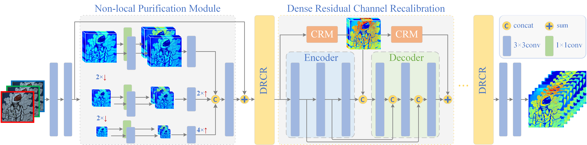
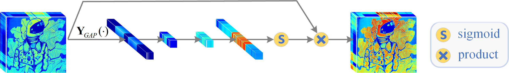

# DRCR Net: Dense Residual Channel Re-calibration Network with Non-local Purification for Spectral Super Resolution (CVPRW 2022)
[](https://codalab.lisn.upsaclay.fr/competitions/721#learn_the_details)
[](https://openaccess.thecvf.com/content/CVPR2022W/NTIRE/papers/Li_DRCR_Net_Dense_Residual_Channel_Re-Calibration_Network_With_Non-Local_Purification_CVPRW_2022_paper.pdf)


[Jiaojiao Li](https://scholar.google.com/citations?user=Ccu3-acAAAAJ&hl=zh-CN&oi=ao), [Songcheng Du](https://github.com/dusongcheng), [Chaoxiong Wu](https://scholar.google.com/citations?user=PIsTkkEAAAAJ&hl=zh-CN&oi=ao), [Yihong Leng](), [Rui Song](https://scholar.google.com/citations?user=_SKooBYAAAAJ&hl=zh-CN&oi=sra) and [Yunsong Li]()

<hr />

> **Abstract:** Spectral super resolution (SSR) aims to reconstruct the 3D hyperspectral signal from a 2D RGB image, which is prosperous with the proliferation of Convolutional Neural Networks (CNNs) and increased access to RGB/hyperspectral datasets. Nevertheless, most CNN-based spectral reconstruction (SR) algorithms can only perform high reconstruction accuracy when the input RGB image is relatively ‘clean' with foregone spectral response functions. Unfortunately, in the real world, images are contaminated by mixed noise, bad illumination conditions, compression, artifacts etc. and the existing state-of-the-art (SOTA) methods are no longer working well. To conquer these drawbacks, we propose a novel dense residual channel re-calibration network (DRCR Net) with non-local purification for achieving robust SSR results, which first performs the interference removal through a non-local purification module (NPM) to refine the RGB inputs. To be specific, as the main component of backbone, the dense residual channel re-calibration (DRCR) block is cascaded with an encoder-decoder paradigm through several cross-layer dense residual connections, to capture the deep spatial-spectral interactions, which further improve the generalization ability of the network effectively. Furthermore, we customize dual channel re-calibration modules (CRMs) which are embedded in each DRCR block to adaptively re-calibrate channel-wise feature response for pursuing high-fidelity spectral recovery. In the NTIRE 2022 Spectral Reconstruction Challenge, our entry obtained the 3rd ranking.
<hr />


## DRCR Net Framework



## CRM



## Train
1. #### Download the dataset.

- Download the training spectral images ([Google Drive](https://drive.google.com/file/d/1FQBfDd248dCKClR-BpX5V2drSbeyhKcq/view))
- Download the training RGB images ([Google Drive](https://drive.google.com/file/d/1A4GUXhVc5k5d_79gNvokEtVPG290qVkd/view))
- Download  the validation spectral images ([Google Drive](https://drive.google.com/file/d/12QY8LHab3gzljZc3V6UyHgBee48wh9un/view))
- Download the validation RGB images ([Google Drive](https://drive.google.com/file/d/19vBR_8Il1qcaEZsK42aGfvg5lCuvLh1A/view))

Put all downloaded files to `/DRCR-Net-master/Dataset/`, and this repo is collected as the following form:
 ```shell
	|--DRCR-Net-master
		|--figures
		|--test
		|--train  
		|--Dataset 
            |--Train_spectral
				|--ARAD_1K_0001.mat
				|--ARAD_1K_0002.mat
				： 
				|--ARAD_1K_0900.mat
			|--Train_RGB
				|--ARAD_1K_0001.jpg
				|--ARAD_1K_0002.jpg
				： 
				|--ARAD_1K_0900.jpg
			|--Valid_soectral
				|--ARAD_1K_0901.mat
				|--ARAD_1K_0902.mat
				： 
				|--ARAD_1K_0950.mat
			|--Valid_RGB
				|--ARAD_1K_0901.jpg
				|--ARAD_1K_0902.jpg
				： 
				|--ARAD_1K_0950.jpg
 ```
2. #### Data Preprocess.
```shell
cd /DRCR-Net-master/train/

# Getting the prepared train data by run:
python train_data_preprocess.py --data_path '../Dataset' --patch_size 128 --stride 64 --train_data_path './dataset/Train'

# Getting the prepared valid data by run:
python valid_data_preprocess.py --data_path '../Dataset' --valid_data_path './dataset/Valid'
```
3. #### Training.
```shell
python main.py
```
The data generated during training will be recorded in `/RealWorldResults/`.
## Test
```shell
cd /DRCR-Net-master/test/
python test.py --RGB_dir '../Dataset/Valid_RGB' --model_dir './model/model.pth' --result_dir './test_results'

# The MRAE and RMSE indicators can be obtained by run:
python compute_mrae.py --path_rec './test_results' --path_gt '../Dataset/Valid_spectral'
```
- Download the model ([Google Drive](https://drive.google.com/file/d/1UJfP6cw9b1EWCGHPnsGEV8AYlr9JTVYC/view?usp=sharing) / [Baidu Disk](https://pan.baidu.com/s/1rHc80ZRg7m893_hCObYAlQ), code: `drcr`))
- Download the reconstructed valid spectral images  ([Google Drive](https://drive.google.com/file/d/1gdF-W4OkKN7Z345ayWzsOuaBMh0p5lcm/view?usp=sharing) / [Baidu Disk](https://pan.baidu.com/s/1Wd3NQfVp4bA_IBMT5dayhg), code: `drcr`))

## Citation
If you find this code helpful, please kindly cite:
```shell
# DRCR Net
@InProceedings{Li_2022_CVPR,
    author    = {Li, Jiaojiao and Du, Songcheng and Wu, Chaoxiong and Leng, Yihong and Song, Rui and Li, Yunsong},
    title     = {DRCR Net: Dense Residual Channel Re-Calibration Network With Non-Local Purification for Spectral Super Resolution},
    booktitle = {Proceedings of the IEEE/CVF Conference on Computer Vision and Pattern Recognition (CVPR) Workshops},
    month     = {June},
    year      = {2022},
    pages     = {1259-1268}
}
```
## CVPRW poster

